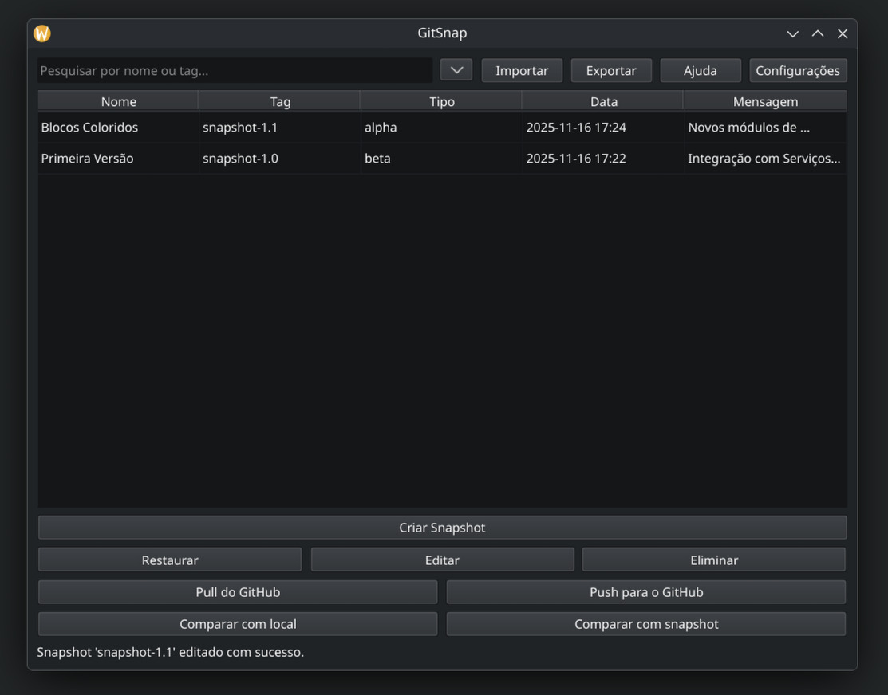

# GitSnap

[](https://badge.fury.io/py/git-snap)
[](https://opensource.org/licenses/MIT)

**GitSnap** é uma aplicação gráfica (GUI) que transforma o `git` numa ferramenta de "snapshots" intuitiva e poderosa. Foi desenhada para simplificar o versionamento, focando-se na segurança e na facilidade de uso, tanto para projetos locais como para sincronização com o GitHub.



---

## O Conceito: Snapshots

Em vez do ciclo `add -> commit -> tag -> push`, o GitSnap utiliza o conceito de **Snapshot**: uma "fotografia" completa do estado do seu projeto num determinado momento. Isto torna o processo de guardar e restaurar versões muito mais simples.

## Funcionalidades Principais

-   **Gestão de Snapshots Locais:** Crie, liste, edite, e restaure "fotografias" do seu projeto.
-   **Comparação Visual:** Compare o estado de um snapshot com a sua versão local ou compare dois snapshots entre si para ver as diferenças.
-   **Sincronização com o GitHub:** Envie (Push) e receba (Pull) snapshots de e para um repositório remoto no GitHub.
-   **Importar e Exportar:** Exporte snapshots para um ficheiro `.bundle` para backups offline ou importe-os noutra máquina.

## Instalação e Uso

#### Sistemas Operativos Suportados
O GitSnap é construído com PySide6, o que o torna compatível com os principais sistemas operativos:
-   **Windows**
-   **macOS**
-   **Linux**

#### Instalação
A forma recomendada de instalar é através do `pipx`, que isola a aplicação do resto do sistema:
```bash
pipx install git-snap
```

#### Executar a Aplicação
Após a instalação, pode iniciar a interface gráfica com o comando:
```bash
git-snap
```

## Atualização e Desinstalação

#### Atualizar o GitSnap
Para atualizar para a versão mais recente:
```bash
# Se instalou com pipx
pipx upgrade git-snap

# Se instalou com pip
pip install --upgrade git-snap
```

#### Desinstalar o GitSnap
Para remover completamente o programa:
```bash
# Se instalou com pipx
pipx uninstall git-snap

# Se instalou com pip
pip uninstall git-snap
```

## Configuração

#### Ficheiro de Configuração
O GitSnap guarda as suas configurações (como nome de utilizador, email e URL do repositório) num ficheiro `config.json`. Pode encontrá-lo nos seguintes locais:
-   **Linux/macOS:** `~/.gitsnap/config.json`
-   **Windows:** `C:\Users\<SeuUtilizador>\.gitsnap\config.json`

#### Integração com o GitHub: Tokens
Para sincronizar com o GitHub, o GitSnap utiliza um **Personal Access Token**.

**Como gerar um Token no GitHub:**
1.  Vá a **GitHub Settings** > **Developer settings** > **Personal access tokens** > **Tokens (classic)**.
2.  Clique em **Generate new token** (e depois **Generate new token (classic)**).
3.  Dê um nome ao token (ex: `gitsnap-token`) e defina uma data de expiração.
4.  Em **Select scopes**, marque a caixa `repo`.
5.  Clique em **Generate token** e copie o token gerado.

O GitSnap irá pedir este token na primeira vez que tentar fazer uma operação com o GitHub.